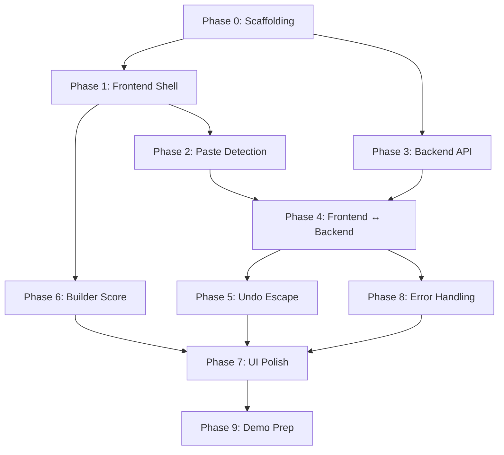

# 📋 Anti-Copilot — Build Task Checklist

> **Format**: Linear checklist with sub-feature granularity.
> Each task includes acceptance criteria, pseudo-code/logic, and dependency chain.
> Git checkpoints marked with 🔒.

---

## Legend

- `[ ]` — Not started
- `[/]` — In progress
- `[x]` — Complete
- `⚠️ BLOCKER` — This task blocks subsequent tasks
- `🔒 GIT` — Commit checkpoint
- `📁 FILES` — Files created or modified
- `🧪 SMOKE TEST` — Quick manual verification
- `🧠 LOGIC` — Pseudo-code and base logic for AI agent

---

## Phase 0: Project Scaffolding & Environment Setup

> **Goal**: Empty project structure with both servers running.
> **Dependency**: None — this is the starting point.

---

### 0.1 Initialize Git Repository ⚠️ BLOCKER

- [ ] Initialize git repo at project root (`/home/nexion/Desktop/anti ai/`)
- [ ] Create `.gitignore` with standard Node, Python, env exclusions

📁 FILES: `.gitignore`

🧠 LOGIC:
```bash
cd "/home/nexion/Desktop/anti ai"
git init
# .gitignore should include:
# node_modules/, dist/, .env, __pycache__/, venv/, *.pyc, .vite/
```

---

### 0.2 Scaffold Frontend (Vite + React + TypeScript) ⚠️ BLOCKER

- [ ] Create `frontend/` directory
- [ ] Scaffold Vite project with React + TypeScript template inside `frontend/`
- [ ] Verify `npm run dev` starts on `http://localhost:5173`

📁 FILES: `frontend/` (entire scaffold)

🧠 LOGIC:
```bash
mkdir frontend
cd frontend
npm create vite@latest ./ -- --template react-ts
npm install
npm run dev  # verify localhost:5173 shows default Vite page
```

🧪 SMOKE TEST: Browser shows default Vite React page on `localhost:5173`.

---

### 0.3 Install Frontend Dependencies ⚠️ BLOCKER

- [ ] Install Tailwind CSS v4.1 (zero-config)
- [ ] Install Monaco Editor React wrapper
- [ ] Install react-hot-toast
- [ ] Install react-markdown
- [ ] Set `strict: false` in `tsconfig.json`

📁 FILES: `frontend/package.json`, `frontend/tsconfig.json`

🧠 LOGIC:
```bash
cd frontend
npm install @tailwindcss/vite          # Tailwind v4 Vite plugin
npm install tailwindcss@latest         # Tailwind v4 core
npm install @monaco-editor/react       # Monaco editor
npm install react-hot-toast            # Toast notifications
npm install react-markdown             # Markdown rendering for Claude responses
```

For Tailwind v4, update `vite.config.ts`:
```ts
import tailwindcss from '@tailwindcss/vite'

export default defineConfig({
  plugins: [react(), tailwindcss()],
})
```

Add to the main CSS file (`src/index.css`):
```css
@import "tailwindcss";
```

In `tsconfig.json`, ensure:
```json
{
  "compilerOptions": {
    "strict": false
  }
}
```

🧪 SMOKE TEST: `npm run dev` still compiles. Tailwind classes work (add a test `className="text-red-500"` and verify red text).

---

### 0.4 Scaffold Backend (FastAPI + Python) ⚠️ BLOCKER

- [ ] Create `backend/` directory with sub-structure
- [ ] Create Python virtual environment
- [ ] Create `requirements.txt` with all dependencies
- [ ] Install all Python dependencies
- [ ] Create `main.py` with minimal FastAPI app + CORS
- [ ] Create `.env.example`
- [ ] Create `.env` (with placeholder key)
- [ ] Create `backend/services/` directory
- [ ] Create `backend/models/` directory
- [ ] Verify `uvicorn main:app --reload` starts on port 8000

📁 FILES:
```
backend/
├── main.py
├── requirements.txt
├── .env
├── .env.example
├── services/       (empty dir with __init__.py)
└── models/         (empty dir with __init__.py)
```

🧠 LOGIC:

`requirements.txt`:
```
fastapi
uvicorn[standard]
anthropic
python-dotenv
pydantic
sse-starlette
```

`main.py` (minimal):
```python
from fastapi import FastAPI
from fastapi.middleware.cors import CORSMiddleware
from dotenv import load_dotenv

load_dotenv()

app = FastAPI(title="Anti-Copilot API")

app.add_middleware(
    CORSMiddleware,
    allow_origins=["http://localhost:5173"],
    allow_credentials=True,
    allow_methods=["*"],
    allow_headers=["*"],
)

@app.get("/")
def health():
    return {"status": "Anti-Copilot API Running"}
```

`.env.example`:
```
ANTHROPIC_API_KEY=your-api-key-here
CLAUDE_MODEL=claude-3-5-sonnet-20241022
```

🧪 SMOKE TEST: `curl http://localhost:8000/` returns `{"status": "Anti-Copilot API Running"}`.

---

### 🔒 GIT CHECKPOINT: `git commit -m "Phase 0: Project scaffolding complete — both servers running"`

---

## Phase 1: Frontend Shell (Layout + Monaco Editor)

> **Goal**: Split-pane layout with working Monaco editor pre-loaded with FastAPI boilerplate.
> **Dependency**: Phase 0 complete.

---

### 1.1 Create Navbar Component

- [ ] Create `src/components/Navbar.tsx`
- [ ] Render app title "Anti-Copilot" on the left
- [ ] Render placeholder Builder Score (static `0.0`) in center
- [ ] Style: dark background, fixed top, full width

📁 FILES: `frontend/src/components/Navbar.tsx`

🧠 LOGIC:
```tsx
// Navbar.tsx
// Props: score (number)
// Display: "Anti-Copilot" left | "Builder Score: {score.toFixed(1)}" center
// Color logic: score > 0 → green, score < 0 → red, score === 0 → white/neutral
// Tailwind: bg-gray-900, text-white, flex, items-center, justify-between, px-6, h-14
```

---

### 1.2 Create Code Editor Component ⚠️ BLOCKER

- [ ] Create `src/components/CodeEditor.tsx`
- [ ] Render Monaco Editor with `vs-dark` theme, language `python`
- [ ] Pre-load the exact 18-line FastAPI boilerplate as default value
- [ ] Disable minimap
- [ ] Set font size 14, word wrap on
- [ ] Expose editor instance ref for paste/undo hooks

📁 FILES: `frontend/src/components/CodeEditor.tsx`

🧠 LOGIC:
```tsx
// CodeEditor.tsx
// Uses: @monaco-editor/react → <Editor /> component
//
// Props:
//   isLocked: boolean           → controls readOnly state
//   onEditorMount: (editor, monaco) => void   → exposes editor instance to parent
//   onContentChange: (value: string) => void  → for score tracking
//
// Default value (string constant):
const DEFAULT_CODE = `from fastapi import FastAPI
from pydantic import BaseModel
from fastapi.middleware.cors import CORSMiddleware

app = FastAPI()

app.add_middleware(
    CORSMiddleware,
    allow_origins=["http://localhost:5173"],
    allow_credentials=True,
    allow_methods=["*"],
    allow_headers=["*"],
)

@app.get("/")
def health_check():
    return {"status": "Anti-Copilot API Running"}`;

// Editor options:
// {
//   theme: "vs-dark",
//   language: "python",
//   minimap: { enabled: false },
//   fontSize: 14,
//   wordWrap: "on",
//   readOnly: isLocked,    ← controlled by parent via props
//   automaticLayout: true,
// }
//
// On mount: call props.onEditorMount(editorInstance, monacoInstance)
// On change: call props.onContentChange(newValue)
```

---

### 1.3 Create Mentor Sidebar Component (Idle State Only)

- [ ] Create `src/components/MentorSidebar.tsx`
- [ ] Render idle state: "🧠 Mentor" header + "I am watching your code structure."
- [ ] Style: dark panel, right side, full height, 30% width
- [ ] Leave placeholder for quiz active state (will be built in Phase 3)

📁 FILES: `frontend/src/components/MentorSidebar.tsx`

🧠 LOGIC:
```tsx
// MentorSidebar.tsx
// Props:
//   quizState: "idle" | "streaming" | "waiting_answer" | "evaluating" | "passed" | "failed"
//   currentQuestion: string
//   questionNumber: 1 | 2
//   streamingText: string
//   onSubmitAnswer: (answer: string) => void
//
// Idle render: Just show header + idle message
// Active render: (built later in Phase 3)
//   - Show streamed question text (rendered via react-markdown)
//   - Show <textarea> for answer input
//   - Enter = submit, Shift+Enter = newline
//   - Show "Question 1 of 2" / "Question 2 of 2" indicator
//
// Tailwind: bg-gray-800, border-l, border-gray-700, p-4, flex, flex-col
```

---

### 1.4 Assemble App Layout (Split Pane)

- [ ] Update `src/App.tsx` with the split-pane layout
- [ ] Top: Navbar (full width)
- [ ] Left (70%): CodeEditor
- [ ] Right (30%): MentorSidebar
- [ ] Add `<Toaster />` from react-hot-toast
- [ ] Clean up default Vite boilerplate (remove starter CSS/content)

📁 FILES: `frontend/src/App.tsx`, `frontend/src/App.css` (or `index.css`)

🧠 LOGIC:
```tsx
// App.tsx layout structure:
// <div className="h-screen flex flex-col bg-gray-950 text-white">
//   <Navbar score={score} />
//   <div className="flex flex-1 overflow-hidden">
//     <div className="w-[70%]">
//       <CodeEditor ... />
//     </div>
//     <div className="w-[30%]">
//       <MentorSidebar ... />
//     </div>
//   </div>
//   <Toaster position="top-right" />
// </div>
//
// State managed in App.tsx (lifted state):
//   const [score, setScore] = useState(0);
//   const [isLocked, setIsLocked] = useState(false);
//   const [editorInstance, setEditorInstance] = useState(null);
//   // ... more state added in later phases
```

🧪 SMOKE TEST:
- Browser shows dark split-pane layout
- Monaco editor renders on left (70%) with FastAPI boilerplate
- Sidebar shows "I am watching your code structure." on right (30%)
- Navbar shows "Anti-Copilot" + "Builder Score: 0.0"
- Editor is editable (not locked)

---

### 🔒 GIT CHECKPOINT: `git commit -m "Phase 1: Frontend shell — layout, Monaco editor, navbar, sidebar idle state"`

---

## Phase 2: Paste Detection & Lock Mechanism

> **Goal**: Pasting >= 25 lines locks the editor with blur overlay and glassmorphism modal.
> **Dependency**: Phase 1 (Monaco editor must be mounted and exposing editor instance).

---

### 2.1 Create Paste Detection Hook ⚠️ BLOCKER

- [ ] Create `src/hooks/usePasteDetection.ts`
- [ ] Hook into Monaco's `editor.onDidPaste` event
- [ ] Count pasted lines using `text.split('\n').length`
- [ ] If `>= 25` lines, trigger lock callback with pasted text
- [ ] Store `editor.getModel().getAlternativeVersionId()` BEFORE the paste is applied

📁 FILES: `frontend/src/hooks/usePasteDetection.ts`

🧠 LOGIC:
```ts
// usePasteDetection.ts
//
// Input: editorInstance (Monaco editor ref), onPasteDetected callback
// 
// CRITICAL: Monaco's onDidPaste fires AFTER the paste is applied to the model.
// To get the pre-paste versionId, we need to track it BEFORE the paste.
//
// Strategy:
//   1. Track the alternativeVersionId continuously on every content change.
//      Store the "last known" versionId BEFORE any paste event.
//   2. On paste event (editor.onDidPaste):
//      - e.range gives the range that was pasted
//      - Get the pasted text from the model using editor.getModel().getValueInRange(e.range)
//      - Count lines: pastedText.split('\n').length
//      - If >= 25 lines:
//          - Call onPasteDetected({ pastedText, lineCount, prePasteVersionId })
//
// Implementation detail:
//   Use a useRef to store the "previous" versionId.
//   On editor.onDidChangeModelContent → update the ref (but NOT during a paste lock).
//   On editor.onDidPaste → read the ref for the pre-paste versionId.
//
// Return: { prePasteVersionId } for use by the Undo Escape Hatch
//
// useEffect cleanup: dispose all Monaco event listeners on unmount
```

---

### 2.2 Create Lock Overlay Component ⚠️ BLOCKER

- [ ] Create `src/components/LockOverlay.tsx`
- [ ] Full coverage over the editor pane (absolute positioned)
- [ ] Background: `rgba(0, 0, 0, 0.5)` + `backdrop-filter: blur(4px)`
- [ ] Centered glassmorphism modal card
- [ ] Display warning icon, "Vibe Coding Detected", lines pasted count, score penalty
- [ ] NO close button, NO click-outside-to-dismiss
- [ ] Direct user to "Answer in the Mentor panel →"

📁 FILES: `frontend/src/components/LockOverlay.tsx`

🧠 LOGIC:
```tsx
// LockOverlay.tsx
// Props:
//   linesPasted: number
//   scorePenalty: number     → linesPasted * -0.2
//   isVisible: boolean
//
// Render only when isVisible === true
//
// Structure:
// <div className="absolute inset-0 z-50 flex items-center justify-center"
//      style={{ backdropFilter: "blur(4px)", backgroundColor: "rgba(0,0,0,0.5)" }}>
//   <div className="glassmorphism-modal">
//     <!-- Glassmorphism card -->
//     <!-- bg-white/10 backdrop-blur-xl border border-white/20 rounded-2xl p-8 -->
//     <h2>⚠️ Vibe Coding Detected</h2>
//     <p>Explain this logic to proceed.</p>
//     <p>Lines pasted: {linesPasted}</p>
//     <p>Score penalty: {scorePenalty.toFixed(1)}</p>
//     <p>Answer in the Mentor panel →</p>
//   </div>
// </div>
//
// The overlay is positioned RELATIVE to the editor pane container (not full page).
// The editor pane container needs `position: relative` for this to work.
```

---

### 2.3 Wire Paste Detection to Lock State

- [ ] In `App.tsx`, connect `usePasteDetection` hook to editor instance
- [ ] On paste detected (>= 25 lines):
  - Set `isLocked = true`
  - Set `pastedCode = pastedText`
  - Set `linesPasted = lineCount`
  - Store `prePasteVersionId`
  - Deduct score: `setScore(prev => prev - lineCount * 0.2)`
- [ ] Pass `isLocked` to `CodeEditor` (controls `readOnly`)
- [ ] Pass `isLocked`, `linesPasted`, penalty to `LockOverlay`
- [ ] Wrap editor pane in a `position: relative` container

📁 FILES: `frontend/src/App.tsx`

🧠 LOGIC:
```tsx
// In App.tsx:
//
// New state:
//   const [isLocked, setIsLocked] = useState(false);
//   const [pastedCode, setPastedCode] = useState("");
//   const [linesPasted, setLinesPasted] = useState(0);
//   const [prePasteVersionId, setPrePasteVersionId] = useState<number | null>(null);
//
// Paste handler:
//   const handlePasteDetected = ({ pastedText, lineCount, prePasteVersionId }) => {
//     setIsLocked(true);
//     setPastedCode(pastedText);
//     setLinesPasted(lineCount);
//     setPrePasteVersionId(prePasteVersionId);
//     setScore(prev => prev - lineCount * 0.2);
//     // TODO (Phase 3): trigger API call to /analyze_paste
//   };
//
// Layout with overlay:
//   <div className="w-[70%] relative">        ← relative for overlay positioning
//     <CodeEditor isLocked={isLocked} ... />
//     {isLocked && <LockOverlay linesPasted={linesPasted} scorePenalty={linesPasted * -0.2} isVisible={isLocked} />}
//   </div>
```

🧪 SMOKE TEST:
- Type normally in editor — no lock
- Paste < 25 lines — no lock
- Paste >= 25 lines — editor becomes read-only, blur overlay appears, modal shows
- Cannot type or paste while locked
- Score drops by `0.2 × lines` on paste

---

### 🔒 GIT CHECKPOINT: `git commit -m "Phase 2: Paste detection and lock overlay working"`

---

## Phase 3: Backend API — Claude Integration

> **Goal**: FastAPI endpoints for analyzing pasted code and validating answers via Claude.
> **Dependency**: Phase 0.4 (backend scaffold must exist).

---

### 3.1 Create Pydantic Models (Request/Response Schemas)

- [ ] Create `backend/models/schemas.py`
- [ ] Define `AnalyzePasteRequest` model
- [ ] Define `ValidateAnswerQ1Request` model
- [ ] Define `ValidateAnswerQ2Request` model
- [ ] Define `ValidateAnswerResponse` model

📁 FILES: `backend/models/schemas.py`

🧠 LOGIC:
```python
# schemas.py
from pydantic import BaseModel
from typing import Optional, Literal

class AnalyzePasteRequest(BaseModel):
    code_snippet: str       # The pasted block (>= 25 lines)
    context_summary: str    # Full main.py content

class ValidateAnswerRequest(BaseModel):
    question: str           # The question text
    user_answer: str        # User's answer
    code_snippet: str       # The pasted code block
    question_number: int    # 1 or 2
    # For Q2, also include Q1 context:
    question_1: Optional[str] = None
    answer_1: Optional[str] = None

class ValidateAnswerResponse(BaseModel):
    status: str             # "next_question" | "pass" | "fail"
    feedback: str           # Claude's feedback
    next_question: Optional[str] = None  # Q2 text (only when status="next_question")
```

---

### 3.2 Create Claude Service ⚠️ BLOCKER

- [ ] Create `backend/services/claude_service.py`
- [ ] Initialize Anthropic client using `ANTHROPIC_API_KEY` from `.env`
- [ ] Implement `stream_question()` — streams Claude's first question about pasted code
- [ ] Implement `generate_next_question()` — after Q1 answer, generates Q2
- [ ] Implement `evaluate_combined()` — evaluates both answers, returns pass/fail
- [ ] Include the system prompt (Senior Engineer persona, no code blocks)

📁 FILES: `backend/services/claude_service.py`

🧠 LOGIC:
```python
# claude_service.py
import os
import anthropic
from dotenv import load_dotenv

load_dotenv()
client = anthropic.Anthropic(api_key=os.getenv("ANTHROPIC_API_KEY"))
MODEL = os.getenv("CLAUDE_MODEL", "claude-3-5-sonnet-20241022")

SYSTEM_PROMPT = """You are a Senior Software Engineer conducting a code review.
You are part of the "Anti-Copilot" system that detects when developers paste code without understanding it.

RULES:
1. You MUST NOT output any code blocks (no ```, no inline code with backticks).
2. Ask ONE conceptual question about the pasted code.
3. Focus on: security implications, performance concerns, error handling gaps, or architectural decisions.
4. Keep the question concise (2-3 sentences max).
5. Address the developer directly ("you", "your code").
6. Be firm but educational, like a mentoring senior engineer."""

async def stream_first_question(code_snippet: str, context_summary: str):
    """
    Streams Q1 via Claude API using anthropic's streaming.
    Yields text chunks as they arrive.
    
    User message: "The developer just pasted this code into their editor:\n\n
    PASTED CODE:\n{code_snippet}\n\n
    FULL FILE CONTEXT:\n{context_summary}\n\n
    Ask ONE question about this pasted code."
    """
    with client.messages.stream(
        model=MODEL,
        max_tokens=300,
        system=SYSTEM_PROMPT,
        messages=[{"role": "user", "content": f"..."}]
    ) as stream:
        for text in stream.text_stream:
            yield text

async def generate_second_question(code_snippet: str, question_1: str, answer_1: str):
    """
    After user answers Q1, generate Q2.
    Include Q1 + A1 in the conversation for context.
    Returns Q2 text (non-streaming is fine here, or stream if preferred).
    
    Message chain:
    - User: "Pasted code: {code_snippet}"  
    - Assistant: "{question_1}"
    - User: "{answer_1}"
    - User: "Ask a SECOND, different question about the same code."
    """
    # Return the full Q2 text

async def evaluate_combined_answers(code_snippet, q1, a1, q2, a2):
    """
    Combined evaluation of both answers.
    
    System prompt addition: "Evaluate if the developer demonstrates genuine 
    understanding of the code. Respond with EXACTLY 'PASS' or 'FAIL' on the 
    first line, followed by a brief explanation."
    
    Parse first line for PASS/FAIL, rest is feedback.
    Returns: { "status": "pass"|"fail", "feedback": "..." }
    """
```

---

### 3.3 Create Mock Service (Fallback) ⚠️ BLOCKER

- [ ] Create `backend/services/mock_service.py`
- [ ] Implement `mock_stream_question()` — streams hardcoded Q1
- [ ] Implement `mock_second_question()` — returns hardcoded Q2
- [ ] Implement `mock_evaluate()` — always returns "pass"
- [ ] Add artificial streaming delay (50ms per word) to simulate realism

📁 FILES: `backend/services/mock_service.py`

🧠 LOGIC:
```python
# mock_service.py
import asyncio

MOCK_Q1 = "Hold up. You just pasted a database connection block but didn't include a teardown method. What happens to the connection pool if this fails?"

MOCK_Q2 = "Okay, assuming you add a teardown, explain the time complexity of the nested loop on line 14 of that snippet."

async def mock_stream_question():
    """Stream MOCK_Q1 word by word with 50ms delay between words."""
    words = MOCK_Q1.split(" ")
    for word in words:
        yield word + " "
        await asyncio.sleep(0.05)

async def mock_second_question():
    """Return MOCK_Q2 as plain string."""
    return MOCK_Q2

async def mock_evaluate():
    """Always pass."""
    return {"status": "pass", "feedback": "Good understanding demonstrated. Your editor is now unlocked."}
```

---

### 3.4 Create FastAPI Endpoints ⚠️ BLOCKER

- [ ] Add `POST /analyze_paste` — SSE streaming endpoint
- [ ] Add `POST /validate_answer` — JSON endpoint
- [ ] Add `POST /mock_stream` — SSE mock fallback endpoint
- [ ] Add `POST /mock_validate` — JSON mock fallback endpoint
- [ ] Wire up Claude service and mock service
- [ ] Handle 10-second timeout on Claude calls

📁 FILES: `backend/main.py`

🧠 LOGIC:
```python
# main.py — Add these routes:

from fastapi import FastAPI, HTTPException
from fastapi.responses import StreamingResponse
from sse_starlette.sse import EventSourceResponse
from models.schemas import AnalyzePasteRequest, ValidateAnswerRequest, ValidateAnswerResponse
from services.claude_service import stream_first_question, generate_second_question, evaluate_combined_answers
from services.mock_service import mock_stream_question, mock_second_question, mock_evaluate
import asyncio

@app.post("/analyze_paste")
async def analyze_paste(request: AnalyzePasteRequest):
    """
    SSE endpoint. Streams Claude's first question about the pasted code.
    Uses EventSourceResponse from sse-starlette.
    
    Wraps stream_first_question() in a generator that yields SSE events.
    Each yield: {"data": text_chunk}
    Final yield: {"data": "[DONE]"}
    
    Timeout: asyncio.wait_for() with 10 second limit.
    On timeout: yield single event with timeout message, then [DONE].
    """

@app.post("/validate_answer")
async def validate_answer(request: ValidateAnswerRequest):
    """
    JSON endpoint.
    
    If question_number == 1:
        → Don't evaluate Q1. Generate Q2 via Claude.
        → Return: { status: "next_question", feedback: "...", next_question: "Q2 text" }
    
    If question_number == 2:
        → Evaluate combined Q1+A1 and Q2+A2.
        → Return: { status: "pass"|"fail", feedback: "..." }
    
    Timeout: 10 seconds. On timeout → return { status: "pass", feedback: "Timeout - bypassed" }
    """

@app.post("/mock_stream")
async def mock_stream(request: AnalyzePasteRequest):
    """Same interface as /analyze_paste but uses mock_service."""

@app.post("/mock_validate")
async def mock_validate(request: ValidateAnswerRequest):
    """Same interface as /validate_answer but uses mock_service. Always passes."""
```

🧪 SMOKE TEST:
```bash
# Test analyze_paste (should stream text):
curl -X POST http://localhost:8000/analyze_paste \
  -H "Content-Type: application/json" \
  -d '{"code_snippet": "import sqlite3\nconn = sqlite3.connect(...)\n...", "context_summary": "full file"}'

# Test mock_stream (should stream hardcoded question):
curl -X POST http://localhost:8000/mock_stream \
  -H "Content-Type: application/json" \
  -d '{"code_snippet": "test", "context_summary": "test"}'
```

---

### 🔒 GIT CHECKPOINT: `git commit -m "Phase 3: Backend API complete — Claude + mock endpoints"`

---

## Phase 4: Frontend ↔ Backend Integration (SSE Streaming)

> **Goal**: Paste triggers API call, question streams into sidebar, user can answer.
> **Dependency**: Phase 2 (paste detection) + Phase 3 (backend endpoints).

---

### 4.1 Create API Service Layer

- [ ] Create `src/services/api.ts`
- [ ] Implement `analyzePaste()` — POST to `/analyze_paste`, handle SSE stream
- [ ] Implement `validateAnswer()` — POST to `/validate_answer`, return JSON
- [ ] Add mock mode toggle (single boolean constant `USE_MOCK = false`)
- [ ] When `USE_MOCK = true`, hit `/mock_stream` and `/mock_validate` instead
- [ ] Implement 10-second frontend timeout using `AbortController`

📁 FILES: `frontend/src/services/api.ts`

🧠 LOGIC:
```ts
// api.ts

const API_BASE = "http://localhost:8000";
const USE_MOCK = false;  // Flip to true for demo fallback

export async function analyzePaste(
  codeSnippet: string,
  contextSummary: string,
  onChunk: (text: string) => void,   // callback for each SSE chunk
  onDone: () => void,                // callback when stream finishes
  onError: (error: string) => void   // callback on error/timeout
): Promise<void> {
  const endpoint = USE_MOCK ? "/mock_stream" : "/analyze_paste";
  const controller = new AbortController();
  const timeoutId = setTimeout(() => controller.abort(), 10000); // 10s timeout

  try {
    const response = await fetch(`${API_BASE}${endpoint}`, {
      method: "POST",
      headers: { "Content-Type": "application/json" },
      body: JSON.stringify({ code_snippet: codeSnippet, context_summary: contextSummary }),
      signal: controller.signal,
    });

    const reader = response.body.getReader();
    const decoder = new TextDecoder();

    while (true) {
      const { done, value } = await reader.read();
      if (done) break;
      const chunk = decoder.decode(value);
      // Parse SSE format: lines starting with "data: "
      // Extract text, skip [DONE]
      // Call onChunk(extractedText)
    }
    clearTimeout(timeoutId);
    onDone();
  } catch (error) {
    clearTimeout(timeoutId);
    if (error.name === "AbortError") {
      onError("Network Timeout - Bypassing verification");
    } else {
      onError(error.message);
    }
  }
}

export async function validateAnswer(payload: ValidateAnswerPayload): Promise<ValidateAnswerResponse> {
  const endpoint = USE_MOCK ? "/mock_validate" : "/validate_answer";
  const response = await fetch(`${API_BASE}${endpoint}`, {
    method: "POST",
    headers: { "Content-Type": "application/json" },
    body: JSON.stringify(payload),
  });
  return response.json();
}
```

---

### 4.2 Build Active Quiz UI in Mentor Sidebar

- [ ] Update `MentorSidebar.tsx` to handle quiz active state
- [ ] Render streaming question text via `react-markdown`
- [ ] Show `<textarea>` for answer input
- [ ] Handle Enter to submit, Shift+Enter for newline
- [ ] Show question progress indicator ("Question 1 of 2")
- [ ] Show quiz result feedback (pass/fail message)
- [ ] Show loading state while waiting for Claude's response

📁 FILES: `frontend/src/components/MentorSidebar.tsx`

🧠 LOGIC:
```tsx
// MentorSidebar.tsx — Active Quiz Updates
//
// State flow managed by parent (App.tsx), passed as props:
//   quizState: "idle" | "streaming_q1" | "answering_q1" | "streaming_q2" | "answering_q2" | "evaluating" | "passed" | "failed"
//   streamingText: string          → accumulated streamed text (grows as chunks arrive)
//   questionNumber: 1 | 2
//   onSubmitAnswer: (answer) => void
//
// UI Rendering by state:
//
// "idle" → Show idle message
//
// "streaming_q1" | "streaming_q2" →
//   Show question text via <ReactMarkdown>{streamingText}</ReactMarkdown>
//   Show "Thinking..." or partial text as it streams
//   Disable the answer textarea (still streaming)
//
// "answering_q1" | "answering_q2" →
//   Show full question text
//   Show enabled <textarea>
//   Show "Submit" button / Enter to submit
//   Show "Question {n} of 2"
//
// "evaluating" →
//   Show spinner/loading
//
// "passed" →
//   Show success message + feedback
//   Green styling
//
// "failed" →
//   Show failure message + feedback
//   Red styling + "Press Ctrl+Z to undo"
//
// Textarea keydown handler:
//   if (e.key === "Enter" && !e.shiftKey) {
//     e.preventDefault();
//     onSubmitAnswer(textareaValue);
//   }
```

---

### 4.3 Wire Full Quiz Flow in App.tsx ⚠️ BLOCKER

- [ ] On paste detected → call `analyzePaste()` from api.ts
- [ ] Stream Q1 text into sidebar via `onChunk` callback
- [ ] When Q1 stream done → set state to "answering_q1"
- [ ] On Q1 answer submit → call `validateAnswer()` with question_number=1
- [ ] Receive Q2 → stream Q2 text into sidebar
- [ ] When Q2 stream done → set state to "answering_q2"
- [ ] On Q2 answer submit → call `validateAnswer()` with question_number=2
- [ ] On "pass" → unlock editor, show success toast
- [ ] On "fail" → keep locked, show failure toast
- [ ] On timeout → auto-unlock editor, show timeout toast

📁 FILES: `frontend/src/App.tsx`

🧠 LOGIC:
```tsx
// App.tsx — Quiz Flow Orchestration
//
// New state:
//   const [quizState, setQuizState] = useState("idle");
//   const [streamingText, setStreamingText] = useState("");
//   const [questionNumber, setQuestionNumber] = useState(1);
//   const [q1Text, setQ1Text] = useState("");
//   const [a1Text, setA1Text] = useState("");
//   const abortControllerRef = useRef<AbortController | null>(null);
//
// handlePasteDetected flow (updated from Phase 2):
//   1. Lock editor, deduct score (already done)
//   2. setQuizState("streaming_q1")
//   3. setStreamingText("")
//   4. Call analyzePaste(pastedCode, fullEditorContent,
//        onChunk: (text) => setStreamingText(prev => prev + text),
//        onDone: () => {
//          setQuizState("answering_q1");
//          setQ1Text(streamingText);  // save full Q1 text
//        },
//        onError: (err) => {
//          toast.error(err);
//          unlockEditor();  // auto-unlock on timeout
//        }
//      )
//
// handleSubmitAnswer:
//   if questionNumber === 1:
//     setQuizState("streaming_q2");
//     setA1Text(answer);
//     Call validateAnswer({ question: q1Text, user_answer: answer, code_snippet: pastedCode, question_number: 1 })
//     Response has next_question → stream Q2 (or set directly)
//     setQuizState("answering_q2"), setQuestionNumber(2)
//
//   if questionNumber === 2:
//     setQuizState("evaluating");
//     Call validateAnswer({ question_1: q1Text, answer_1: a1Text, question_2: q2Text, answer_2: answer, code_snippet: pastedCode, question_number: 2 })
//     if response.status === "pass":
//       unlockEditor();  // BUT don't refund score
//       toast.success("Knowledge verified! Editor unlocked.");
//       setQuizState("passed");
//     if response.status === "fail":
//       toast.error("Understanding not demonstrated. Press Ctrl+Z to undo.");
//       setQuizState("failed");
//
// unlockEditor():
//   setIsLocked(false);
//   setQuizState("idle");
//   setStreamingText("");
//   setQuestionNumber(1);
//   // NOTE: Score penalty stays on quiz pass and on timeout. Only refunded on Ctrl+Z undo.
```

🧪 SMOKE TEST:
- Paste >= 25 lines → editor locks, blur appears, Q1 streams into sidebar
- Type an answer, press Enter → Q2 appears
- Type an answer, press Enter → pass/fail result appears
- On pass → editor unlocks, toast shows success
- On fail → editor stays locked, toast shows failure
- If backend is stopped → 10 second timeout → auto-unlock with toast

---

### 🔒 GIT CHECKPOINT: `git commit -m "Phase 4: Full quiz flow working — paste → lock → Q1 → Q2 → verdict"`

---

## Phase 5: Undo Escape Hatch (Ctrl+Z)

> **Goal**: Ctrl+Z fully reverts paste, unlocks editor, refunds score.
> **Dependency**: Phase 2 (prePasteVersionId must be stored).

---

### 5.1 Create Undo Escape Hook

- [ ] Create `src/hooks/useUndoEscape.ts`
- [ ] Listen for `editor.onDidChangeModelContent` while locked
- [ ] On each content change, check if `editor.getModel().getAlternativeVersionId()` matches stored `prePasteVersionId`
- [ ] If match → trigger unlock callback with score refund
- [ ] Important: Monaco must be temporarily set to `readOnly: false` to allow Ctrl+Z, then re-locked if undo is partial

📁 FILES: `frontend/src/hooks/useUndoEscape.ts`

🧠 LOGIC:
```ts
// useUndoEscape.ts
//
// CRITICAL DESIGN CHALLENGE:
// When editor is readOnly: true, Ctrl+Z is blocked.
// Solution options:
//   A) Listen for keyboard Ctrl+Z globally, temporarily disable readOnly,
//      execute undo programmatically, re-enable readOnly.
//   B) Instead of using Monaco's readOnly, use a transparent overlay to
//      block mouse/keyboard input BUT still allow Ctrl+Z to pass through.
//
// RECOMMENDED APPROACH: Option A
//
// Logic:
//   1. Add a global keydown listener when isLocked === true
//   2. On Ctrl+Z (e.ctrlKey && e.key === 'z'):
//      a) Temporarily set editor.updateOptions({ readOnly: false })
//      b) editor.trigger('keyboard', 'undo', null)  // programmatic undo
//      c) Check if getAlternativeVersionId() === prePasteVersionId
//         - YES → Full undo achieved! Call onUndoComplete()
//         - NO  → Partial undo. Set editor.updateOptions({ readOnly: true }) again.
//   3. onUndoComplete:
//      - Keep readOnly: false (editor is unlocked now)
//      - Dismiss overlay
//      - Refund score
//      - Abort any in-flight SSE stream
//      - Reset quiz state
//
// Cleanup: Remove keydown listener on unmount or when isLocked becomes false.
```

---

### 5.2 Wire Undo Escape to App State

- [ ] Connect `useUndoEscape` hook in `App.tsx`
- [ ] On undo complete: unlock editor, refund score, reset quiz, dismiss overlay
- [ ] Abort any in-flight API calls/SSE streams
- [ ] Show toast: "Paste undone. Score restored."

📁 FILES: `frontend/src/App.tsx`

🧠 LOGIC:
```tsx
// App.tsx — Undo handler
//
// const handleUndoComplete = () => {
//   setIsLocked(false);
//   setScore(prev => prev + linesPasted * 0.2);  // REFUND the penalty
//   setQuizState("idle");
//   setStreamingText("");
//   setQuestionNumber(1);
//   setPastedCode("");
//   setLinesPasted(0);
//   // Abort in-flight SSE:
//   if (abortControllerRef.current) {
//     abortControllerRef.current.abort();
//   }
//   toast.success("Paste undone. Score restored.");
// };
```

🧪 SMOKE TEST:
- Paste >= 25 lines → editor locks, score drops
- Press Ctrl+Z repeatedly → pasted text removes character by character
- When all pasted text is fully undone → editor unlocks automatically
- Score is refunded to pre-paste value
- Overlay and quiz modal disappear
- Toast shows "Paste undone. Score restored."
- Partial Ctrl+Z (not fully undone) → editor stays locked

---

### 🔒 GIT CHECKPOINT: `git commit -m "Phase 5: Undo escape hatch — Ctrl+Z reverts paste, refunds score"`

---

## Phase 6: Builder Score System

> **Goal**: Dynamic score that increases on typing and displays with color coding.
> **Dependency**: Phase 1 (Navbar must exist).

---

### 6.1 Create Builder Score Hook

- [ ] Create `src/hooks/useBuilderScore.ts`
- [ ] Track character count on Monaco content change
- [ ] If character count increases (typing), add +0.2 (debounced 500ms)
- [ ] Expose `score`, `addScore(n)`, `deductScore(n)` for paste/undo events
- [ ] Score starts at 0, no min/max caps

📁 FILES: `frontend/src/hooks/useBuilderScore.ts`

🧠 LOGIC:
```ts
// useBuilderScore.ts
//
// State: score (number), previousCharCount (ref)
//
// updateOnTyping(currentContent: string):
//   const currentCharCount = currentContent.length;
//   if (currentCharCount > previousCharCountRef.current) {
//     // Character count increased = typing (not deleting)
//     // Debounce 500ms before adding score
//     debouncedAddScore(0.2);
//   }
//   previousCharCountRef.current = currentCharCount;
//
// Debounce implementation:
//   Use a useRef for timeout ID
//   On each call, clear previous timeout, set new one for 500ms
//   When timeout fires: setScore(prev => prev + 0.2)
//
// IMPORTANT: Do NOT trigger score increase when editor is locked (readOnly).
//   Check isLocked flag before adding score.
//
// Exposed API:
//   return { score, addScore, deductScore, updateOnTyping }
```

---

### 6.2 Wire Score to Navbar Display

- [ ] Pass `score` from `useBuilderScore` to `Navbar.tsx`
- [ ] Display `score.toFixed(1)` with color coding
- [ ] Green when positive, red when negative, neutral when zero
- [ ] Connect `updateOnTyping` to Monaco's `onContentChange`

📁 FILES: `frontend/src/App.tsx`, `frontend/src/components/Navbar.tsx`

🧠 LOGIC:
```tsx
// Navbar.tsx update:
//   <span className={score > 0 ? "text-green-400" : score < 0 ? "text-red-400" : "text-gray-300"}>
//     Builder Score: {score.toFixed(1)}
//   </span>
//
// App.tsx update:
//   Replace the direct useState score with useBuilderScore hook.
//   On editor content change: builderScore.updateOnTyping(newContent)
//   On paste detected: builderScore.deductScore(lineCount * 0.2)
//   On undo: builderScore.addScore(linesPasted * 0.2)
```

🧪 SMOKE TEST:
- Type in editor → score goes green, increases by 0.2 per debounced typing burst
- Stop typing for 500ms, type again → another +0.2
- Rapid typing without pause → only one +0.2 (debounced)
- Paste >= 25 lines → score drops red
- Ctrl+Z undo → score refunded back
- Delete characters → score does NOT change (only increases matter)

---

### 🔒 GIT CHECKPOINT: `git commit -m "Phase 6: Builder Score — dynamic typing rewards, color-coded navbar display"`

---

## Phase 7: UI Polish & Visual Refinement

> **Goal**: Professional, hackathon-winning aesthetics.
> **Dependency**: All core features (Phases 1–6).

---

### 7.1 Polish Lock Overlay Glassmorphism

- [ ] Refine glassmorphism effect: `bg-white/5`, `backdrop-blur-xl`, `border border-white/10`
- [ ] Add subtle gradient border or glow effect
- [ ] Animate modal entrance (fade-in + gentle scale)
- [ ] Warning icon styling (⚠️ enlarged, animated pulse)
- [ ] Typography: crisp, clean hierarchy of header vs. body text

📁 FILES: `frontend/src/components/LockOverlay.tsx`

---

### 7.2 Polish Mentor Sidebar Transitions

- [ ] Smooth transition from idle state to active quiz state
- [ ] Streaming text appears smoothly (no layout jumps)
- [ ] Answer textarea has focus ring and proper styling
- [ ] Question progress ("1 of 2") has subtle badge styling
- [ ] Pass/fail result has distinct visual states (green glow vs red glow)

📁 FILES: `frontend/src/components/MentorSidebar.tsx`

---

### 7.3 Polish Navbar & Score Animation

- [ ] Score change animates (brief scale or pulse when value changes)
- [ ] Navbar has subtle bottom border or shadow
- [ ] App title is distinctive (weight, spacing)

📁 FILES: `frontend/src/components/Navbar.tsx`

---

### 7.4 Global Styling & Theme Consistency

- [ ] Ensure consistent dark theme across all components
- [ ] Set up CSS custom properties for accent colors if needed
- [ ] Ensure Monaco editor fills its container perfectly (no scrollbar issues)
- [ ] Remove any default Vite/React styling artifacts

📁 FILES: `frontend/src/index.css`, `frontend/src/App.css`

🧪 SMOKE TEST:
- Full app looks professional and cohesive
- Overlay transition is smooth (no flicker)
- Score color change is visible and satisfying
- Sidebar state transitions feel polished
- No layout jumps or visual glitches during the paste → lock → quiz flow

---

### 🔒 GIT CHECKPOINT: `git commit -m "Phase 7: UI polish — glassmorphism, animations, visual refinement"`

---

## Phase 8: Error Handling & Resilience

> **Goal**: Bulletproof demo — nothing crashes.
> **Dependency**: Phase 4 (API integration must be in place).

---

### 8.1 Frontend Timeout & Error Handling

- [ ] All `fetch()` calls wrapped in try/catch
- [ ] 10-second `AbortController` timeout on all Claude API calls
- [ ] On timeout → `toast.error("Network Timeout - Bypassing verification")` → auto-unlock
- [ ] On any unhandled error → toast notification, UI does NOT crash
- [ ] Console errors acceptable (demo-grade)

📁 FILES: `frontend/src/services/api.ts`, `frontend/src/App.tsx`

---

### 8.2 Backend Timeout & Error Handling

- [ ] Wrap Claude API calls in `asyncio.wait_for(coro, timeout=10.0)`
- [ ] On `asyncio.TimeoutError` → return timeout response, don't crash server
- [ ] Standard `HTTPException` for 400/500/503 errors
- [ ] Backend stays alive even if Claude is unreachable

📁 FILES: `backend/main.py`, `backend/services/claude_service.py`

---

### 8.3 Mock Mode Toggle

- [ ] Verify `USE_MOCK = true` in `api.ts` switches all calls to mock endpoints
- [ ] Mock endpoints work identically to real ones from frontend perspective
- [ ] Switching between real/mock requires only changing one constant

📁 FILES: `frontend/src/services/api.ts`

🧪 SMOKE TEST:
- Stop backend → frontend shows toast error, does NOT crash
- Set `USE_MOCK = true` → full flow works with hardcoded questions
- Manually delay Claude response > 10s → frontend auto-unlocks with toast
- Multiple rapid pastes (edge case) → no crash or double-lock state

---

### 🔒 GIT CHECKPOINT: `git commit -m "Phase 8: Error handling — timeout auto-unlock, mock toggle, resilient UI"`

---

## Phase 9: Demo Preparation

> **Goal**: Complete demo script, paste snippet, and rehearsal readiness.
> **Dependency**: All phases (1–8) complete.

---

### 9.1 Create Demo Paste Snippet (`database.py`)

- [ ] Create the 35–40 line Python snippet that will be pasted during the demo
- [ ] Snippet should have obvious architectural concerns (missing error handling, security issues, performance problems) that Claude can ask about
- [ ] Save as `structure/demo_paste_snippet.py` for easy clipboard access

📁 FILES: `structure/demo_paste_snippet.py`

🧠 LOGIC:
```python
# demo_paste_snippet.py — This is what you copy-paste during the live demo.
# It should have ~35 lines and contain obvious review targets:
# 1. A database connection without proper cleanup/context manager
# 2. SQL injection vulnerability (string formatting in query)
# 3. A nested loop with bad time complexity
# 4. Missing error handling
# 5. Hardcoded credentials
#
# Example structure:
# import sqlite3
# 
# DB_PASSWORD = "admin123"          ← hardcoded credential
#
# def get_user_data(username):
#     conn = sqlite3.connect("app.db")    ← no context manager / no close()
#     cursor = conn.cursor()
#     query = f"SELECT * FROM users WHERE name = '{username}'"   ← SQL injection
#     cursor.execute(query)
#     results = cursor.fetchall()
#     
#     processed_data = []
#     for user in results:                  ← nested loop
#         for record in get_all_records():
#             if record["user_id"] == user[0]:
#                 processed_data.append(...)
#     
#     return processed_data
# ... (pad to 35+ lines with more functions)
```

---

### 9.2 Create Demo Script Document

- [ ] Write step-by-step demo script with exact actions
- [ ] Include what to say at each step (talking points)
- [ ] Include fallback actions if something goes wrong
- [ ] Include pre-demo checklist

📁 FILES: `structure/demo_script.md`

🧠 LOGIC:
```markdown
# Pre-Demo Checklist:
# - [ ] Backend running: uvicorn main:app --reload --port 8000
# - [ ] Frontend running: npm run dev (localhost:5173)
# - [ ] .env has valid ANTHROPIC_API_KEY
# - [ ] Browser on http://localhost:5173 (Chrome)
# - [ ] demo_paste_snippet.py content copied to clipboard
# - [ ] Score shows 0.0

# Demo Steps:
# 1. SHOW the editor → "This is a Socratic coding environment."
# 2. TYPE a few lines → Watch score go GREEN
# 3. PASTE the snippet → BOOM! Editor locks, blur activates
# 4. EXPLAIN to judges what just happened
# 5. ANSWER Q1 in sidebar → Show the Socratic dialog
# 6. ANSWER Q2 → Get verdict
# 7. (If fail) Show Ctrl+Z escape → Score refunds!
# 8. CONCLUDE with the mission statement
```

---

### 9.3 Create README.md

- [ ] Project title, description, and motivation
- [ ] Tech stack badges
- [ ] Setup instructions (frontend + backend)
- [ ] Usage overview with screenshots/description
- [ ] API documentation summary
- [ ] Architecture overview

📁 FILES: `README.md` (project root)

---

### 9.4 Final Integration Test

- [ ] Run the complete Golden Path flow end-to-end
- [ ] Verify all checkpoints from the manual verification list:

```
- [ ] Paste >= 25 lines → Editor locks
- [ ] Paste < 25 lines → No lock
- [ ] Blur overlay appears correctly
- [ ] Quiz Q1 streams into sidebar
- [ ] User answers Q1 → Q2 streams
- [ ] User answers Q2 → Pass → Editor unlocks
- [ ] User answers Q2 → Fail → Editor stays locked
- [ ] Ctrl+Z undoes paste → Editor unlocks, score refunded
- [ ] Score increments on typing (+0.2)
- [ ] Score decrements on paste (-0.2 × lines)
- [ ] API timeout (>10s) → Auto-unlock with toast
- [ ] Mock endpoint works as fallback
- [ ] Fresh browser refresh → Score resets to 0
```

---

### 🔒 GIT CHECKPOINT: `git commit -m "Phase 9: Demo ready — paste snippet, demo script, README, final verification"`

---

## Dependency Chain Summary

```
Phase 0 (Scaffold)
  ├──→ Phase 1 (Frontend Shell)
  │      └──→ Phase 2 (Paste Detection + Lock)
  │             └──→ Phase 4 (Frontend ↔ Backend Integration)
  │                    └──→ Phase 5 (Undo Escape Hatch)
  │                    └──→ Phase 8 (Error Handling)
  │
  ├──→ Phase 3 (Backend API)
  │      └──→ Phase 4 (Frontend ↔ Backend Integration)
  │
  ├──→ Phase 6 (Builder Score) — can be built in parallel after Phase 1
  │
  ├──→ Phase 7 (UI Polish) — after Phases 1–6
  │
  └──→ Phase 9 (Demo Prep) — after ALL phases
```



---

## Minimum Viable Demo (Emergency Cut List)

> If severely behind, these features can be **cut** while still having a convincing demo:

| Priority | Feature              | Cut? | Impact                                          |
|----------|----------------------|------|-------------------------------------------------|
| P0       | Paste → Lock → Quiz  | ❌   | **Core demo. CANNOT cut.**                      |
| P1       | SSE Streaming        | ⚡   | Degrade to non-streaming (full response at once) |
| P2       | Builder Score        | ⚡   | Show as static `0.0`, skip typing rewards        |
| P3       | Undo Escape Hatch    | ⚡   | Demo only the quiz path, skip Ctrl+Z feature     |
| P4       | UI Polish            | ⚡   | Ship with functional but less polished UI        |
| P5       | Mock Fallback        | ⚡   | Rely on real API only (risky but saves time)     |
